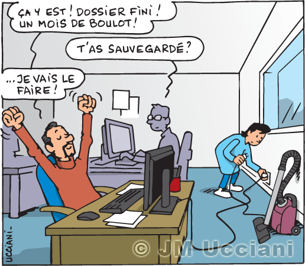

# Les actualités

**:construction:**

## Les petites news du numérique

- Le 15 décembre, [premier pas vers plus de sobriété numérique](./sobre)...

- Le 30 septembre, nouveau tuto sur l'utilisation de Word.

- Vous saviez que tout s'enregistre automatiquement sur le pack office ?? 
Si ce n'est pas enregistré, vous retrouverez votre document dans les brouillons ou "consulté récemment"

-  

- Lors de la semaine du 12 septembre, les nouveaux élèves ont reçu leur tablette !

- 
> *Les élèves quand on leur dit que la tablette est un outil pédagogique !*

## Espace Numérique de Travail

Pour accéder à l'ENT de l'établissement, cliquez [ici](https://ent.ecmorlaix.fr/#features-section).
Vous y trouverez : 
  * les applications
  * les portails d'évaluation et de certification
  * les manuels numériques
  * les ressources du CDI et PMB

## Conseil numérique

*Le conseil numérique, kézako ?*

C'est un regroupement de professionnels de l'établissement (vie scolaire, enseignant, direction) qui échangent sur l'utilisation du numérique et des tablettes au sein du lycée. Ils évoquent les problématiques rencontrées, les fonctionnements des uns et des autres, les fonctionnements dans les autres établissements ainsi que les pistes de travail dans le but d'améliorer l'utilisation de la tablette comme outil pédagogique.

## Atelier du numérique

Ouvert aux enseignants, il permet de présenter les possibilités offertes par la tablette, de former aux basiques de la tablette et d'échanger sur les outils de chacun.

## FAQ

*Un élève a perdu ses codes ecoledirecte*  
     --> L'élève pourra recevoir ses codes école directe en se rendant à l'accueil auprès de Nathalie Ondo-Oddou.

*Un élève a accès à écoledirecte mais dit ne pas avoir accès à sa carte de self numérique*  
    --> Il est connecté sur le compte ecoledirecte de ses parents.

*Je ne vois pas certains élèves sur l'application en classe*  
    --> Les élèves, pour être visibles sur enclasse, doivent utiliser le Wifi du lycée. S'ils utilisent leur partage de connexion, ils ne sont pas visibles ! 
Attention, ils vont à l'encontre de la charte du numérique qu'ils ont signé.

*Où puis-je trouver un exemple de la charte du numérique ?*  
    --> Juste [ici](https://www.ecmorlaix.fr/uploads/2018/09/charte-informatique-2019.pdf)
    
*Quel outil peut m'aider à rédiger car je fais beaucoup de fautes d'orthographe ?*
    --> Tu peux dicter le texte à rédiger sur Word en utilisant le micro. Word souligne en rouge lorsque le mot n'est pas connu ou présente une faute et en bleu lorsqu'il y a une faute d'accord.
    
*J'ai preparé un design sur Canva mais je n'arrive pas à le télécharger car il faut payer ?*
    --> Si c'est pour un travail à rendre à ton enseignant partage le document ~~ou fais une capture d'écran que tu lui envoies~~ ==peu [sobre](./sobre) !==.
