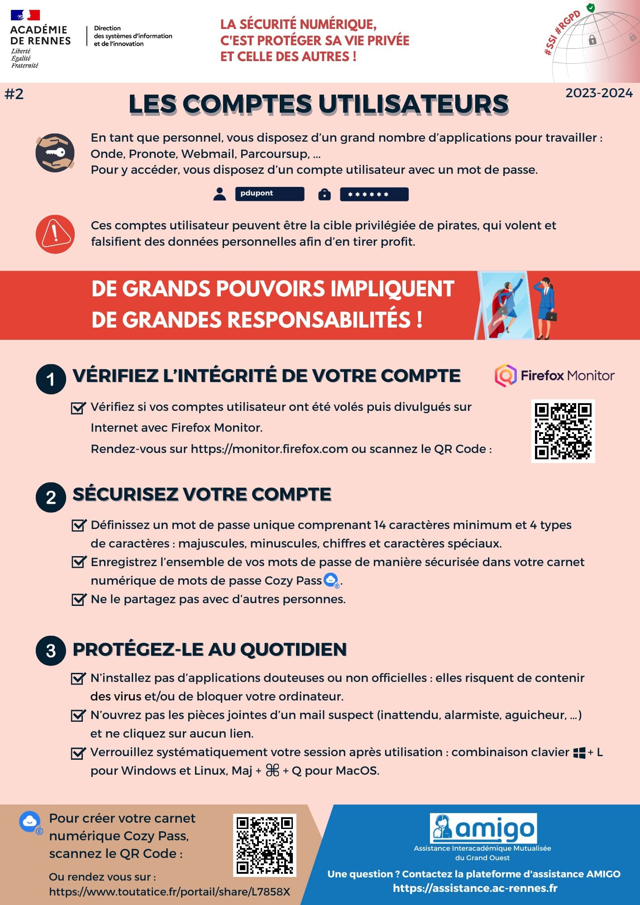

# Cybersécurité 

## Hackathon 2nde 

Le but est de faire prendre conscience aux élèves de seconde des enjeux de la cybersécurité. Pour cela, nous participons à la campagne de CyberEnJeux.  
L'intéret est de sensibiliser aux enjeux de la cybersécurité en créant un jeu permettant de mettre en oeuvre les connaissances acquises. 

- Le diaporama permet une présentation des différents thèmes de la cybersécurité : 
[Diaporama](./pdf/cyberenjeux_presentation_eleves.pptx)

- Le fichier suivant permet une présentation support du diaporama
[Livret](./pdf/cybersecurite.pdf)

- Le poster suivant permet de résumer les bons reflexes pour se protéger sur Internet :
  [Poster](./pdf/poster_cyber-reflexes2023.pdf)

- Un site vous permet de savoir si certaines de vos données personnelles ont fuité sur Internet :
  

