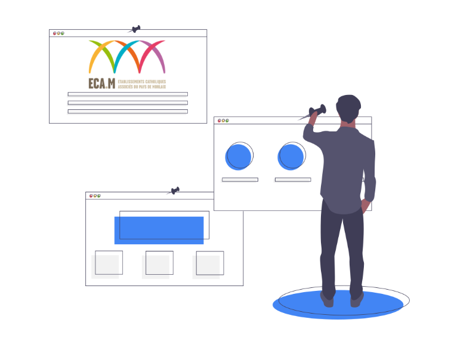

# Espace Numérique de Travail  - ECA.M

Bienvenue sur l'E.N.T. du groupe ECA.M ...

## Ressources LGT et LP

!!! attention " Ressources Lycées"  

    - Livret de rentrée 2024 : [Livret](./pdf/LIVRETRENTREE2023.pdf)  
    - Documents administratifs pour les enseignants et personnels : [Ressources](./docressources.md)  
    - Lycée Le Porsmeur : [LLPR](./lyceepro.md)  
    - Lycée ND Mur : [LNDM](./lyceelgt.md)  
    - Projet Numérique : [projetNUM](./projetnum.md)  

## [Rechercher sur internet](https://www.ecosia.org/?c=fr){:target="_blank"}  

## Accéder aux applications

!!! attention "Mon Espace Ecole directe (EDT, Cahier de texte, Cahier de correspondance, Notes,...)"
    {height="100px" width="100px"} [Ecole Directe](https://www.ecoledirecte.com/){:target="_blank"}  
!!! attention "Mon espace Microsoft Education (Messagerie, Documents, Logiciels Office,..)"
    {height="100px" width="100px"} [Office 365](https://www.office.com/){:target="_blank"}  

!!! attention "EDUCONNECT - Accès ENT Toutatice - Pass Culture "
    {height="100px" width="100px"} [EDUCONNECT](https://educonnect.education.gouv.fr/idp/profile/SAML2/Redirect/SSO?execution=e1s1){:target="_blank"}  

!!! attention "Mon Espace Apple Education (Documents, Photos,..)"
    {height="100px" width="100px"}[ICloud](https://www.icloud.com/){:target="_blank"}  

!!! attention "Logiciel de Modélisation"
    [Sketchup](https://edu.sketchup.com/app){:target="_blank"}  

!!! attention "Ressources pédagogiques"
    {height="100px" width="100px"}
    === "Le Livre Scolaire"
        [LSL](https://www.lelivrescolaire.fr/){:target="_blank"}  
    === "Sésamaths"
        [Manuels](https://manuel.sesamath.net/){:target="_blank"}  
    === "Sites Enseignants"
        - Eric MADEC :
            - [Sites](https://ericecmorlaix.github.io/){:target="_blank"}  
        - Delphine NUNEZ :  
            - [SNT - 2nde](https://dnunez-gua.github.io/SNT/){:target="_blank"}  
            -  [Spécialité Maths Terminales](https://dnunez-gua.github.io/Maths_Terminales/){:target="_blank"}  
        - Florence PETIT :  
            - [PADLET SES](https://padlet.com/florence_petit/ses-terminale-xzh6neigklzw){:target="_blank"}  
        
!!! attention "CDI/PMB - Sites et Bases documentaires des CDI"
    === "Site Web du lycée"
        Actualités du CDI, ressources pédagogiques, parcours éducatif  
        
[se connecter](https://cdi-lycee.ecmorlaix.fr/){:target="_blank"}
  
    === "PMB - Lycée"
        Base Documentaire du CDI du Lycée Nd du Mur - Le Porsmeur  
        
[Se connecter](https://ecmorlaix.basecdi.fr/pmb/opac_css/){:target="_blank"}
  
    === "PMB- Saint-Augustin"
        Base Documentaire du CDI du Collège Saint Augustin  
        
[Se connecter](https://staugustin-morlaix.basecdi.fr/pmb/opac_css/){:target="_blank"}
  
    === "PMB- Saint-Joseph"
        Base Documentaire du CDI du Collège Saint Joseph  
        
[Se connecter](https://stjosephmorlaix.basecdi.fr/pmb/opac_css/){:target="_blank"}
  
    === "PMB- Sainte-Marie"
        Base Documentaire du CDI du Collège Sainte Marie  
        
[Se connecter](lien à revoir){:target="_blank"} 
  
        

        
## Evaluation et Certification
{height="100px" width="100px"}  
!!! attention "Direction de l'évaluation, de la prospective et de la performance"
    [Depp](https://eval.depp.taocloud.fr/){:target="_blank"}  
!!! attention " Evaluation et certification des compétences numériques"
    [PIX](https://app.pix.fr/connexion){:target="_blank"}  
!!! attention "Test de positionnement en anglais - Niveau Collège"
    [Ev@lang](https://evalangcollege.fr/){:target="_blank"}  

## Besoin d'assistance ?

:white_check_mark: Vous êtes élève ou parent d'élève.  
Envoyez-nous un email : [assistance@ecmorlaix.fr](mailto:assistance@ecmorlaix.fr)  

:white_check_mark: Vous êtes enseignant ou personnel.  
Connectez-vous sur l'application GLPI
