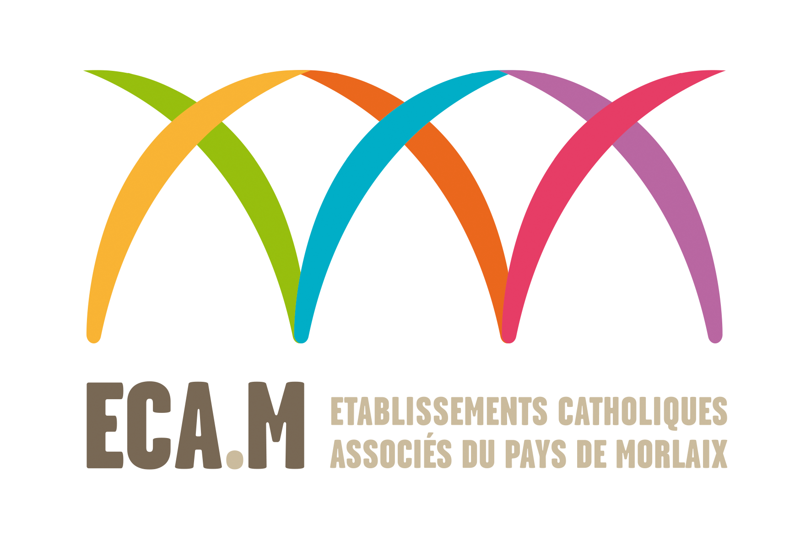

# Page d'accueil Numérique

[{width=30% align=left}](https://ent.ecmorlaix.fr/){target=_blank}

Sur ce site vous trouverez tout ce qu'il faut pour vous aider dans la prise en main de la tablette :

* Les actualités en lien avec l'utilisation de la tablette au sein de l'établissement
* La règlementation
* Les applications lors de la prise en main
* Les indispensables à savoir faire
* Les spéciales enseignants
* Les tutoriels pour les autres applications

{.center}

Si vous souhaitez rajouter un tutoriel que vous avez confectionné merci de prendre contact par [mail](mailto:assistance@ecmorlaix.fr).

