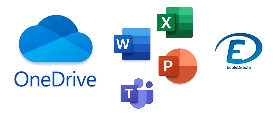
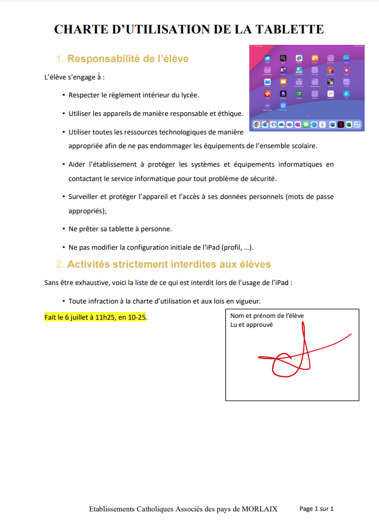
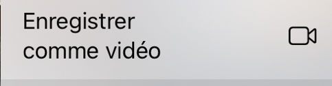

# Prise en main

## Le suivi des compétences

A ouvrir dans Safari, une fois complété vous pouvez le transmettre à votre enseignant en cliquant sur le carré avec la flèche qui va vers le haut {width=10% align=left} puis "annoter". Cela génère un PDF que vous pouvez enregistrer sur votre dossier "Vie_de_classe" - "Formation IPAD" de votre OneDrive.

### Prérequis

- [ ] Je connais mon adresse mail, mon code ecmorlaix et mon compte Ecole Directe.

??? tip "L'identifiant ecmorlaix ?"

    - Ton adresse ecmorlaix conserve le format suivant : **`prenom.nom@eleves.ecmorlaix.fr`**
    - Ton identifiant ecoledirecte est la première lettre de ton prénom suivi de ton nom, exemple : **`pnom`**.

!!! warning ""

    - [ ] ==J'ai mémorisé mon mot de passe et je l'ai aussi inscrit en lieu sûr !== 

### Mise en place

Des tutoriels sont accessibles [indispensables](./indispensables.md)

{align=right width=45%}

- [ ] J’ai toutes les applications suivantes sur ma tablette :
    - [ ] Outlook
    - [ ] Word
    - [ ] OneDrive
    - [ ] EcoleDirecte

- [ ] Je note que je pourrai charger d'autres applications à la maison :
    - [ ] Excel
    - [ ] PowerPoint
    - [ ] Teams
          
???+ tip "Pack Office"
    - [ ] J’ai compris que je peux aussi télécharger le pack office 365 (word, outlook, powerpoint, excel) sur cinq appareils numériques gratuitement grâce à mon adresse ecmorlaix. (ent.ecmorlaix.fr).
    - [ ] Je suis connecté avec mon adresse ecmorlaix sur les différentes applications (OneDrive, Word, PowerPoint, Excel, Teams).
         
???+ tip "Ecole Directe"
    - [ ] Je suis connecté sur Ecole Directe avec mon identifiant et mot de passe temporaire.
    - [ ] Je dois modifier les paramètres d'école directe, je retiens mon identifiant et mot de passe.
    - [ ] Je consulte les informations disponibles sur Ecole Directe (Emploi du temps, Cahier de texte, Cahier de correspondance,...)

## Présentation de l'IPAD

!!! tip "IPAD "
    === "Activités :" 
        1. Ajouter ou supprimer des widgets en appuyant quelques secondes sur l'écran de l'IPAD. Les applications peuvent être supprimées (-) et des widgets ajoutés (+).
        2. Créer des dossiers pour classer les applications. En superposant deux applications et en relachant la pression, cela crée un dossier que vous pourrez renommer.
        3. Paramétrer le Dock en ajoutant sur la partie favori "Ecole Directe" et "Outlook".
        4. Ouvrir Outlook. Faire apparaitre le dock puis selectionner Safari et le glisser à coté d'Outlook pour avoir les 2 applications ouverts. (Remarque : cela ne fonctionne pas avec Ecole Directe)
    === "Bilan :"
        - [ ] J’ai trouvé où se trouvait le AirDrop.
        - [ ] J’ai rangé les widgets d’application sur l’écran d’accueil de ma tablette.
        - [ ] J'ai vu comment changer le wifi.
        - [ ] Je sais paramétrer le Dock.
        - [ ] Je sais partager mon écran pour afficher deux applications. 

## Sauvegarde Cloud

!!! tip "One Drive "
    === "Activités :"

        ???+ example "1 - Créer des dossiers"

            === "Consigne élèves :"

                Depuis l'application `Fichiers`, **créer** dans Onedrive :

                - Un dossier nommé `Vie_de_classe` contenant un sous-dossier nommé `Stages` ;            
                - Un dossier nommé `Cours` contenant des sous-dossiers par matière...

            === "Consigne profs :"

                **Présenter** la création d'une arborescence de dossiers OneDrive depuis l'application `Fichiers`...

        ???+ example "2 - Récupérer un fichier :"

            === "Consigne élèves :"

                - **Enregistrer** dans votre dossier `Stages` le fichier `Convention.pdf` reçu par airdrop ;
                - le **renommer** `Convention_Nom_Prenom.pdf`;
                - puis le **partager** en lecture seule avec votre professeur principal.

            === "Consigne profs :"

                - **Transmettre** le fichier [`Convention.pdf`]() par AirDrop à chaque élèves de la classe ;
                - **Présenter** le nommage et le partage de fichiers ;
                - **Vérifier** le bon partage pour chaque élève.
         
        ???+ example "3 - Portrait chinois :"
        
            === "Consigne élèves :"
                
                - **Ouvrir** le document `Portrait_chinois.docx` partagé avec vous en écriture par votre professeur ;
                - **Renseigner** tous les champs d'une ligne du tableau en respectant l'ordre alphabétique des noms de votre classe ; 
                - **Enregistrer** dans le dossier `Vie_de_classe` de votre OneDrive personnel, une copie du document complété après la synthèse collective...

            === "Consigne profs :"

                - **Créer** dans votre OneDrive un dossier nommé `Portraits` partagé en lecture avec les élèves de la classe ;
                - **placer** dans ce dossier, le fichier [`Portrait_chinois.docx`](../assets/OneDrive/Portrait_chinois.docx) à partager en écriture pour permettre aux élèves de le compléter en ligne ;
                - **Organiser** la modification : _un élève par ligne dans l'ordre alphabétique de la classe_....

        ???+ example "4 - Cadavre Exquis :"
        
            === "Consigne élèves :"

                - Dans chaque groupe un premier élève récupère une copie du fichier `Cadavre_exquis.docx` partagé par votre enseignant et le renomme au nom du groupe ;
                - Ce premier élève complète la phrase "Il était une fois..." avec un premier groupe de mots ;
                - Il transmet ce fichier modifié par AirDrop à son voisin dans le groupe, qui réitère l'opération ;
                - Et ainsi de suite... 
                - Le dernier dépose dans le dossier `Cadavres_exquis` de la classe le fichier final modifié par chaque membre du groupe.

            === "Consigne profs :"

                - **Créer** dans votre OneDrive un dossier nommé `Cadavres_exquis` partagé en écriture avec les élèves de la classe et y **placer** le fichier [`Cadavre_exquis.docx`](../assets/OneDrive/Cadavre_exquis.docx) ;
                - **Organiser** la complétion progressive et la circulation du document (un tour minimum) jusqu'à sa publication...
        

 
    === "Bilan :"
        - [ ] Je crée des dossiers dans OneDrive (une matière = un dossier + un dossier STAGE).
        - [ ] Je sais ouvrir un document en partant du dossier source.
        - [ ] Je sais renommer ce document.
        - [ ] Je sais partager ce document pour que la personne puisse le consulter uniquement.
        - [ ] Je sais partager ce document pour que la personne puisse le modifier.
        - [ ] Je sais créer une copie de ce document pour l’enregistrer dans un autre dossier.

## Navigateur

!!! tip "Safari "
    === "Activités :" 
        1. Ouvrir Safari
        2. Faire une recherche sur les programmes du théâtre de Morlaix.
            - Chercher la date et l'heure d'une représentation en octobre
            - Faire une recherche sur la page
        3. Ouvrir un nouvel onglet
        4. Mettre une page en favori.
        5. Classer les favoris
            a. Créer des dossiers de favoris
            b. Renommer les dossiers
        6. Mettre une page sur l'écran d'accueil
        7. Créer un dossier regroupant les pages web enregistrées. 
        8. Envoyer un lien vers une page web
        9. Envoyer une page via AirDrop
        10. Créer un lien Hypertexte dans un éditeur ou traitement de texte  
        [Théatre](https://www.theatre-du-pays-de-morlaix.fr/){target="_blank"}
	        
    === "Bilan :"
        - [ ] Je sais ouvrir Safari et faire une recherche.
        - [ ] Je sais mettre une page en favori.
        - [ ] Je sais faire une recherche de mot-clé sur une page.
        - [ ] Je sais mettre une page en raccourci écran.
        - [ ] Je sais organiser mes pages web enregistrées (en favoris ou sur l'IPAD).

## Traitement de Texte

!!! tip "Word"
    === "Activités :"
    
        ???+ example "1 - Reproduire la mise en page d'un document"

            === "Consigne élèves :"

                1. **Consulter** le document source : photo ci-contre
                
                {align=right width=45%}
                
                2. Depuis l'application `Word`, **ouvrir** une page blanche
                3. **Enregistrer** le document sur votre ipad dans « Sur mon IPad » sous le nom « Atelier traitement de texte »
                4. **Copier-coller** le texte suivant : 
                *Responsabilité de l’élève L’élève s’engage à̀ : Respecter le règlement intérieur du lycée. Utiliser les appareils de manière responsable et éthique.  Utiliser toutes les ressources technologiques de manière appropriée afin de ne pas endommager les équipements de l’ensemble scolaire. Aider l’établissement à protéger les systèmes et équipements informatiques en contactant le service informatique pour tout problème de sécurité. Surveiller et protéger l’appareil et l’accès à ses données personnelles (mots de passe appropriés) ; Ne prêter sa tablette à personne. Ne pas modifier la configuration initiale de l’iPad (profil, …). Activités strictement interdites aux élèves Sans être exhaustive, voici la liste de ce qui est interdit lors de l’usage de l’iPad : Toute infraction à la charte d’utilisation et aux lois en vigueur.*
                5. **Double-cliquer** en haut du document pour accéder à l’en-tête 
                6. **Écrire** le texte « Charte d’utilisation de la tablette » en majuscule
                7. Mettre la phrase en **gras**
                8. Se rendre en bas du document
                9. **Écrire** le texte « Établissement Catholiques Associés des pays de MORLAIX »
                10. **Insérer** le numéro de page : Insérer —> Feuille avec le # —> Cliquer sur « Inclure le nombre de page » —> Sélectionner en bas à droite
                11. **Sélectionner** le texte brut et mettre une interligne de 1,5 pts
                12. **Remettre** les titres 1 et 2 en forme :
                        a. Couleur : au choix
                        b. Taille : 16
                        c. Police : Times New Roman
                        d. Numérotation à mettre automatiquement 
                13. **Formater** le corps de texte 
                        a. Justifier le texte
                        b. Mettre des puces pour chaque engagement
                14. Prendre une *capture d’écran* de l’écran d’accueil
                15. **Enregistrer** la capture dans les photos
                16. **Insérer** cette photo dans le fichier Word
                17. **Modifier** l’habillage de l’image « Renvoi à la ligne automatique » en cliquant sur « Rapproché »
                18. **Insérer** une zone de texte en bas à droite
                19. Y **écrire** votre nom, votre prénom et « lu et approuvé »
                20. **Signer** à l’aide du crayon dans Dessin
                21. **Dicter** à votre tablette la date, le lieu et l’heure de la rédaction du document
                22. **Surligner** le texte préalablement dicté
                23. **Enregistrer** votre document dans un dossier OneDrive
                24. **Exporter** le document au format PDF

            === "Consigne profs :"

                **Présenter** les outils de mise en page et de correction disponibles sur `Word`...
                
    === "Bilan :"
        - [ ] Je sais ouvrir une page blanche sur `Word`.
        - [ ] Je sais enregistrer ce document `Word` sur mon Ipad.
        - [ ] Je sais enregistrer ce document `Word`en le renommant dans mon dossier OneDrive.
        - [ ] Je sais copier/coller un texte.
        - [ ] Je sais mettre un pied de page.			
        - [ ] Je sais mettre un en-tête.
        - [ ] Je sais mettre en gras.
        - [ ] Je sais mettre un numéro de page de manière automatique.
        - [ ] Je sais ce qu’est un interligne 1,5 et comment le mettre.	
        - [ ] Je sais justifier un texte sur word/open office
        - [ ] Je sais modifier la police, la taille et le style de police.
        - [ ] Je sais faire et enregistrer une capture d'écran
        - [ ] Je sais utiliser les numérotations automatiques.
        - [ ] Je sais insérer une photo dans un fichier word.
        - [ ] Je sais modifier l'habillage de l'image en permettant le texte autour.
        - [ ] Je sais insérer une zone de texte.
        - [ ] Je sais utiliser l'outil dessin dans un fichier `Word`.
        - [ ] Je sais dicter à ma tablette pour rédiger un paragraphe.
        - [ ] Je sais surligner un texte.
        - [ ] Je sais exporter ce fichier en PDF.			
        - [ ] Je sais utiliser le lecteur immersif.
     
## Prise de Notes

!!! tip "Notes"
    === "Remarque :"
        L'application `Notes` doit être utilisée en cahier de brouillon. Pour rendre un travail ou le partager, privilégier les traitements de texte (Word, Pages,...)
    === "Activités :"
        1. Créer un dossier par matière + 1 dossier administration + 1 dossier formation IPAD
        2. Dans le dossier "formation IPAD", créer une nouvelle note
        3. Tester la prise de notes : titre, copie d'un texte, mise en page, image, date...
        4. Scanner un document
        5. Créer un pdf à partir de ses scans
        6. Organiser les pages pour changer l'ordre
        7. Renommer le pdf
        8. Enregistrer le pdf dans OneDrive 
        9. Partager le pdf (mail, AirDrop, OneDrive)
    === "Bilan :"
        - [ ] Je sais créer une nouvelle note
        - [ ] Je sais créer un dossier de notes
        - [ ] Je sais prendre un scan d'un document
        - [ ] Je sais extraire un pdf à partir de scan de document
        - [ ] Je sais insérer une image dans une note

        
## Mail 
!!! tip  "Outlook"
    === "Activités :"
        1. En fin de mail, je dois signer et préciser ma classe 
            - [ ] Vrai
            - [ ] Faux
            
        2.	Quel est le moment le plus approprié pour envoyer un mail ?
            - [ ] À 22h
            - [ ] À 17h, après mes cours
	        - [ ] Un dimanche
            - [ ] À 4h du matin

        3.	Que veut dire CC dans l’en-tête un mail ?
            - [ ] Destinataire caché
            - [ ] Destinataire principal
            - [ ] Destinataire secondaire
            - [ ] L’objet

        4. Je dois renseigner un objet 
            - [ ] Vrai 
            - [ ] Faux

        5. Parmi les 4 propositions, laquelle est fausse
            - [ ] Je signe avec une formule de politesse
            - [ ] Je commence mon mail avec „Bonjour“ ou „Madame“ ou „Monsieur“
            - [ ] Je ne peux pas transmettre un document par mail
            - [ ] Je vérifie l’orthographe avant d’envoyer le mail

        6. Lorsque je reçois un mail qui est adressé à un groupe et que je dois répondre, je
            - [ ] Réponds systématiquement à tout le monde
            - [ ] Réfléchis bien à la nécessité d’envoyer le mail à tout le monde

          7. Pour n’envoyer le mail adressé à un groupe uniquement à l’expéditeur, Je clique en bas du mail sur l’icône des deux flèches à côté de "Répondre à tous“ et je clique sur:
            - [ ] "Répondre à tous“
            - [ ] "Répondre“
            - [ ] "Transférer“
            - [ ] "Modifier ou afficher les destinataires“

        8. Dans "l’Objet“ je renseigne obligatoirement (choix multiples)
            - [ ] le sujet
            - [ ] mon nom et prénom
            - [ ] rien du tout
            - [ ] la matière (si demandé par l’enseignant/e)
            - [ ] ma classe

        9. Lorsque j’envoie un document,
            - [ ] Celui-ci est au format PDF (sauf indication contraire)
            - [ ] Le nom indique mon nom, ma classe et le sujet
            - [ ] Je peux l’envoyer sans modifier son nom
            - [ ] Je n’ai pas besoin de rédiger un texte d’accompagnement expliquant l’envoi

        10. Il est impératif qu’une demande soit rédigée de manière polie et respectueuse, quel que soit le destinataire
            - [ ] Vrai 
            - [ ] Faux

        11. Parmi les propositions suivantes, lequelles vous paraissent appropriées ?
            - [ ] Salut, merci de m’expliquer ma note. Cordialement
            - [ ] Bonjour, comme j’étais absent(e), serait-il possible de me transmettre le document du cours d’aujourd’hui, s’il vous plaît ? En vous remerciant d’avance, Cordialement
            - [ ] Bonjour, comme j’étais absent(e), serait-il possible de me transmettre le document du cours d’aujourd’hui.  
            - [ ] Madame, pouvez-vous m’expliquer ma note s’il-vous plaît ? 
            - [ ] Monsieur, serait-il possible de se voir à la fin du cours demain afin de m’expliquer ma note, s’il-vous-plaît ? En vous remerciant pour votre compréhension, Cordialement 

    
    === "Réponse :"
    
        1. En fin de mail, je dois le signer et préciser ma classe 
            - [x] Vrai
            - [ ] Faux
            
        2.	Quel est le moment le plus approprié pour envoyer un mail ?
            - [ ] À 22h
            - [x] À 17h, après mes cours
	        - [ ] Un dimanche
            - [ ] À 4h du matin

        3.	Que veut dire CC dans l’en-tête un mail ?
            - [ ] Destinataire caché
            - [ ] Destinataire principal
            - [x] Destinataire secondaire
            - [ ] L’objet

        4. Je dois renseigner un objet 
            - [x] Vrai 
            - [ ] Faux

        5. Parmi les 4 propositions, laquelle est fausse
            - [ ] Je signe avec une formule de politesse
            - [ ] Je commence mon mail avec „Bonjour“ ou „Madame“ ou „Monsieur“
            - [x] Je ne peux pas transmettre un document par mail
            - [ ] Je vérifie l’orthographe avant d’envoyer le mail

        6. Lorsque je reçois un mail qui est adressé à un groupe et que je dois répondre, je
            - [ ] Réponds systématiquement à tout le monde
            - [x] Réfléchis bien à la nécessité d’envoyer le mail à tout le monde

          7. Pour n’envoyer le mail adressé à un groupe uniquement à l’expéditeur, Je clique en bas du mail sur l’icône des deux flèches à côté de "Répondre à tous“ et je clique sur:
            - [ ] "Répondre à tous“
            - [x] "Répondre“
            - [ ] "Transférer“
            - [ ] "Modifier ou afficher les destiataires“

        8. Dans "l’Objet“ je renseigne obligatoirement (choix multiples)
            - [x] le sujet
            - [x] mon nom et prénom
            - [ ] rien du tout
            - [ ] la matière (si demandé par l’enseignant/e)
            - [ ] ma classe

        9. Lorsque j’envoie un document,
            - [x] Celui-ci est au format PDF (sauf indication contraire)
            - [x] Le nom indique mon nom, ma classe et le sujet
            - [ ] Je peux l’envoyer sans modifier son nom
            - [ ] Je n’ai pas besoin de rédiger un texte d’accompagnement expliquant l’envoi

        10. Il est impératif qu’une demande soit rédigée de manière polie et respectueuse, quel que soit le destinataire
            - [x] Vrai 
            - [ ] Faux

        11. Parmi les propositions suivantes, lequelles vous paraissent appropriées?
            - [ ] Salut, merci de m’expliquer ma note. Cordialement
            - [x] Bonjour, comme j’étais absent(e), serait-il possible de me transmettre le document du cours d’aujourd’hui, s’il vous plaît ? En vous remerciant d’avance, Cordialement
            - [ ] Bonjour, comme j’étais absent(e), serait-il possible de me transmettre le document du cours d’aujourd’hui.  
            - [ ] Madame, pouvez-vous m’expliquer ma note s’il-vous plaît ? 
            - [x] Monsieur, serait-il possible de se voir à la fin du cours demain afin de m’expliquer ma note, s’il-vous-plaît ? En vous remerciant pour votre compréhension, Cordialement 

## Médias

!!! tip  "Appareil photo"
    === "Activités :"
        1. Prendre une photo d'un manuel scolaire ou d'un document en votre possession
        2. Rogner les contours de la photo grace à l'outil {height="50px" width="50px"} 
        3. Tracer un cercle avec la fonctionnalité "annotation" {height="50px" width="50px"}  
        4. Sélectionner la couleur verte ainsi que la forme du stylo puis tracer le cercle.{height="50px" width="50px"} 
        5. Renommer la photo en l'identifiant et en ajoutant son prénom {height="50px" width="50px"} 
    === "Bilan :"
        - [ ] Je sais prendre une photo (dans le respect du droit à l'image).
        - [ ] Je sais écrire et modifier la photo.
        - [ ] Je sais l’enregistrer dans mes fichiers OneDrive - remarque : les dernières versions de OneDrive permettent de faire des photos ou scans directement dans le dossier sélectionné. 

!!! tip  "Vidéos"
    === "Activités :"
        1. Aller dans la galerie de photos et sélectionner une photo (non modifiée)
        2. Appuyer avec votre doigt dessus quelques secondes
        3. Cliquer sur {height="50px" width="50px"} 
        4. Sélectionner "Enregistrer comme vidéo" {height="100px" width="100px"} 
        5. Retrouver la vidéo dans la galerie.
    === "Bilan :"
        - [ ] Je sais utiliser les paramètres de l'appareil photo pour créer une vidéo.
        - [ ] Je sais comment faire une vidéo capture d'écran.
        

