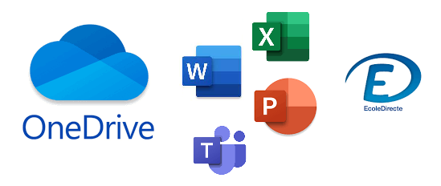

# Prise en main

## Le suivi des compétences

A ouvrir dans Safari, une fois complété vous pouvez le transmettre à votre enseignant en cliquant sur le carré avec la flèche qui va vers le haut {width=10% align=left} puis "annoter". Cela génère un PDF que vous pouvez envoyer à votre enseignant (même icone) par Air Drop ou par mail.

### Prérequis

- [ ] Je connais mon adresse mail, mon code ecmorlaix et mon compte Ecole Directe.

??? tip "L'identifiant ecmorlaix ?"

    - Ton adresse ecmorlaix conserve le format suivant : **`prenom.nom@eleves.ecmorlaix.fr`**
    - Ton identifiant ecoledirecte est la première lettre de ton prénom suivi de ton nom, exemple : **`pnom`**.

!!! warning ""

    - [ ] ==J'ai mémorisé mon mot de passe et je l'ai aussi inscrit en lieu sûr !== 

### Mise en place

Des tutoriels sont accessibles [indispensables](./indispensables.md)

{align=right width=45%}

- [ ] J’ai toutes les applications suivantes sur ma tablette :
    - [ ] Outlook
    - [ ] Word
    - [ ] OneDrive
    - [ ] EcoleDirecte

- [ ] Je note que je pourrais charger d'autres applications à la maison :
    - [ ] Excel
    - [ ] PowerPoint
    - [ ] Teams
          
???+ tip "Pack Office"
    - [ ] J’ai compris que je peux aussi télécharger le pack office 365 (word, outlook, powerpoint, excel) sur cinq appareils numériques gratuitement grâce à mon adresse ecmorlaix. (ent.ecmorlaix.fr).

- [ ] Je suis connectée avec mon adresse ecmorlaix sur les différentes applications (OneDrive, Word, PowerPoint, Excel, Teams).

## Présentation de l'IPAD

!!! tip "IPAD "
    === "Activités :" 
    === "Bilan :"
        - [ ] J’ai trouvé où se trouvait le AirDrop.
        - [ ] J’ai rangé les widgets d’application sur l’écran d’accueil de ma tablette.
        - [ ] J'ai vu comment changer le wifi.
        - [ ] Je sais paramétrer le Dock.
        - [ ] Je sais partager mon écran pour afficher deux applications. 

## Sauvegarde Cloud

!!! tip "One Drive "
    === "Activités :"
        ???+ example "1 - Créer des dossiers"
            === "Consigne élèves :"
                Depuis l'application `Fichiers`, **créer** dans Onedrive :

                - Un dossier nommé `Vie_de_classe` contenant un sous-dossier nommé `Stages` ;            
                - Un dossier nommé `Cours` contenant des sous-dossiers par matière...
            === "Consigne profs :"
                **Présenter** la création d'une arborescence de dossiers OneDrive depuis l'application `Fichiers`...

        ???+ example "2 - Récupérer un fichier :"
            === "Consigne élèves :"

                - **Enregistrer** dans votre dossier `Stages` le fichier `Convention.pdf` reçu par airdrop ;
                - le **renommer** `Convention_Nom_Prenom.pdf`;
                - puis le **partager** en lecture seule avec votre professeur principal.
            === "Consigne profs :"

                - **Transmettre** le fichier [`Convention.pdf`]() par AirDrop à chaque élèves de la classe ;
                - **Présenter** le nommage et le partage de fichiers ;
                - **Vérifier** le bon partage pour chaque élève.
         
        ???+ example "3 - Portrait chinois :"
        
            === "Consigne élèves :"
                
                - **Ouvrir** le document `Portrait_chinois.docx` partagé avec vous en écriture par votre professeur ;
                - **Renseigner** tous les champs d'une ligne du tableau en respectant l'ordre alphabétique des noms de votre classe ; 
                - **Enregistrer** dans le dossier `Vie_de_classe` de votre OneDrive personnel une copie du document complété après la synthèse collective...

            === "Consigne profs :"

                - **Créer** dans votre OneDrive un dossier nommé `Portraits` partagé en lecture avec les élèves de la classe et y **placer** le fichier [`Portrait_chinois.docx`](../assets/OneDrive/Portrait_chinois.docx) à partager en écriture pour permettre aux élèves de le compléter ; **Organiser** la modification : _un élève par ligne dans l'ordre alphabétique de la classe_....

        ???+ example "4 - Cadavre Exquis :"
        
            === "Consigne élèves :"
                ;
            === "Consigne profs :"
                ;
        

 
    === "Bilan :"
        - [ ] Je créé des dossiers dans OneDrive (une matière = un dossier + un dossier STAGE).
        - [ ] Je sais ouvrir un document en partant du dossier source.
        - [ ] Je sais renommer ce document.
        - [ ] Je sais partager ce document pour que la personne puisse le consulter uniquement.
        - [ ] Je sais partager ce document pour que la personne puisse le modifier.
        - [ ] Je sais créer une copie de ce document pour l’enregistrer dans un autre dossier.

## Navigateur

!!! tip "Safari "
    === "Activités :" 
    === "Bilan :"
        - [ ] Je sais ouvrir Safari et faire une recherche.
        - [ ] Je sais mettre une page en favori.
        - [ ] Je sais mettre une page en raccourci écran.
        - [ ] Je sais faire une recherche de mot clé sur une page.

## Traitement de Texte

!!! tip "Word"
    === "Activités :"
    === "Bilan :"
        - [ ] Je sais ouvrir une page blanche sur Word.
        - [ ] Je sais enregistrer ce document Word dans mon dossier OneDrive.
        - [ ] Je sais enregistrer ce document Word dans un dossier OneDrive partagé.
        - [ ] Je sais justifier un texte sur word/open office
        - [ ] Je sais modifier la police, la taille et le style de police.
        - [ ] Je sais enregistrer un document sur l’ordinateur/ Tablette
        - [ ] Je sais insérer une image dans un fichier word et modifier le format du texte autour.
        - [ ] Je sais enregistrer ce fichier en PDF.			
        - [ ] Je sais copier/coller ou couper/coller un texte.
        - [ ] Je sais formater mes titres et mon corps de texte sur word.
        - [ ] Je sais ce qu’est un interligne 1,5 et le mettre.			
        - [ ] Je sais utiliser le micro pour dicter un texte.
        - [ ] Je sais mettre un pied de page.			
        - [ ] Je sais mettre un en-tête.
        - [ ] Je sais mettre un numéro de page.
        - [ ] Je sais où aller pour lire le texte que j’ai tapé sur Word.
        - [ ] Je sais insérer une zone de texte.

## Prise de Notes

!!! tip "Notes"
    === "Activités :"
    === "Bilan :"
        - [ ] Je sais créer une nouvelle note
        - [ ] Je sais créer un dossier de notes
        - [ ] Je sais prendre un scan d'un document
        - [ ] Je sais extraire un pdf à partir de scan de document
        - [ ] Je sais insérer une image dans une note

        
## Mail 
!!! tip  "Outlook"
    === "Activités :"
    === "Bilan :"
        - [ ] Je sais rédiger un mail (un objet clair, des formules de politesse, ...).
        - [ ] Je sais envoyer un mail (un ou plusieurs destinataires principaux ou en copie).
        - [ ] Je sais envoyer un document en pièce jointe (le destinataire pourra facilement identifier le fichier joint par son nom).
        - [ ] Je sais enregistrer une pièce jointe reçue par mail.
        - [ ] Je sais déplacer le fichier (donc je sais où le retrouver).
        - [ ] Je sais le renommer.
        - [ ] Je sais compléter un fichier PDF.

## Médias

!!! tip  "Appareil photo"
    === "Activités :"
    === "Bilan :"
        - [ ] Je sais prendre une photo (dans le respect du droit à l'image).
        - [ ] Je sais écrire et modifier la photo.
        - [ ] Je sais l’enregistrer dans mes fichiers OneDrive.

!!! tip  "Vidéos"
    === "Activités :"
    === "Bilan :"
        - [ ] Je sais utiliser les paramètres de l'appareil photo pour créer une vidéo.
        - [ ] Je sais comment faire une vidéo capture d'écran.
        

