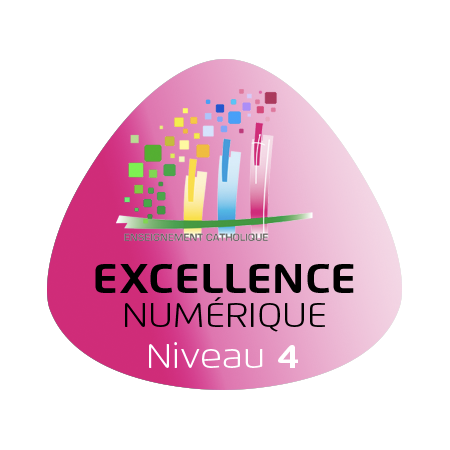
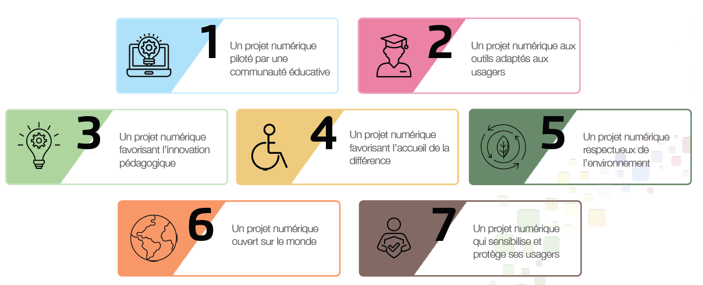

# Projet Numérique - Label Excellence Numérique

Le conseil numérique a travaillé pendant 1 an pour rédiger un projet numérique et pour mettre en place des procédures sur différents piliers : 

- Pilier technique
- Pilier pédagogique
- Pilier didactique

Grâce à ce projet, le lycée a obtenu le label Excellence Numérique niveau 4 

Le label évalue les compétences sur les champs d'actions suivants : 

  
L'ensemble du projet est consultable [Projet Numérique](https://ecmorlaix-my.sharepoint.com/:b:/g/personal/delphine_nunez_ecmorlaix_fr/EUA92nphNKNDgbLY1FYJ00kB8sTAELMTMxVmXvttrRCgcg?e=oR07YF) , cette page permet de donner les procédures adoptées en conseil numérique

## Pilier technique

### Préparation et gestion des bases de données
1. Rôle des professeurs principaux :

    - Renseigner les bases TEAMS des enseignants de leur classe (# LNDM - Enseigants - 1G1) ou (# LLPR - Enseignants - 2MRC)
    - Compléter le tableau (délégués) en complétant les délégués et parents correspondants de leur classe.
    - Communiquer les adresses mails de parents correspondants aux familles via école directe.
    - Communiquer les dates et heures des conseils de classe aux parents correspondants et élèves délégués
  
2. Chaque enseignant peut créer son groupe ou sa classe sur l'application "En Classe".

### Préparation des tablettes professeurs et élèves 

1. La distribution des tablettes aux nouveaux enseignants se fait fin août avec une formation sur les outils principaux.
2. La distribution des tablettes des élèves de seconde se déroule selon un planning établi en conseil numérique
   
3. Une formation est prévue pour chaque élève : 
[Prise en main](./priseenmain.md)  

Une vérification des bons usages de la tablette sera effectuée quelques semaines plus tard (en parallèle de la journée d'intégration).

### Gestion des casses ou des pannes 

1. **En cas de panne pour les enseignants** : faire un ticket [GLPI](https://glpi.ecmorlaix.fr/){target="_blank"} 
2. **En cas de panne pour les élèves** : envoyer un mail au service informatique : [assistance@ecmorlaix.fr](mailto:assistance@ecmorlaix.fr)  
 Si besoin, l'enseignant peut faire un ticket GLPI pour être informé de l'évolution de la prise en charge. 
 Une permanence informatique pour les élèves se déroule les mardis et les jeudis de 9h55 à 10h10 dans le BOX rouge de l'Atrium.
3. **En cas de casse d'une tablette d'un élève** : celui-ci doit voir Doriane DOUARIN à la comptabilité pour faire réparer sa tablette par le prestataire. Il recevra une tablette de prêt et sera informé par mail pour la récupération de sa tablette.
4. **Gestion APPLE TV** : En cas de dysfonctionnement, débrancher l'appareil et le rebrancher.
5. **Pour tout problème informatique** : Wifi, télécommande... faire un ticket GLPI pour remonter le problème afin qu'il soit résolu le plus rapidement possible.

### Mise à disposition des applications sur les logiciels "Enseignants" ou "Elèves"

- Faire une demande par mail à Delphine NUNEZ pour toute demande d'application.

## Pilier pédagogique

L'ensemble des chartes élèves et familles est consultable ici [charte](https://ecmorlaix.sharepoint.com/:b:/s/lndm-conseildedirection/EX0NzKSDmVlLvLA5DXY1IP0BY3WITbdNQz8jebaRq0m6sg?e=OxBMZ1){target="_blank"}  

En cas de non-respect à la charte d'utilisation de l'IPAD, des sanctions pourront être posées. 

| Activité | Sanction          | 
| :--------------- :|:---------------:|
| Oubli de l'IPAD ou IPAD déchargé  |   Remarque Ecole Directe      |  
| Utilisation non appropriée   | Retenue             |   
| Envoi d'e-mail innaproprié  | Remarque, retenue ou avertissement (en fonction de la diffusion et du contenu)       |
| 3 remarques  |  1 retenue          |

## Pilier didactique

### Formation Enseignant

1. Formation des nouveaux enseignants en août pour une prise en main des outils principaux de la tablette :
  
    - Mail, One Drive
    - Ecole Directe
    - Air play
    - GLPI
    - ...
    
2. ADN : Atelier du Numérique
  
    - Proposition d'un atelier hebdomadaire selon les demandes et disponibilités. Un questionnaire forms en lien sur l'ECA.M Info
    - Formation en journée pédagogique, temps forts.   

### Formation Elève

- Une formation pour les élèves de seconde. [prise en main](./priseenmain.md)  

