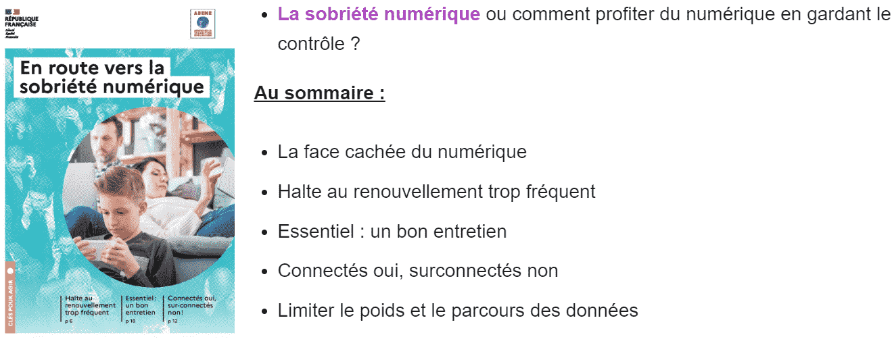
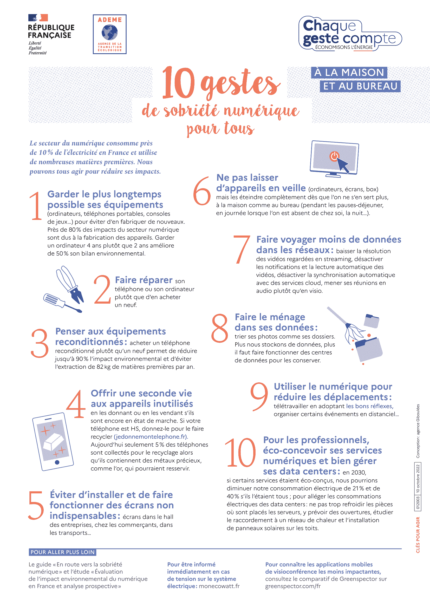

# Sobriété numérique

Comment agir positivement pour la planète dans le domaine du numérique ?

Peut-être simplement en prenant conscience de notre impact, puis en changeant quelques-unes de nos habitudes du quotidien ?

## Les recommandations de l'ADEME

!!! info "L’Agence de la transition écologique publie des documents comme :"

    - ["En route vers la sobriété numérique"](./pdf/guide-en-route-vers-sobriete-numerique-min.pdf){target=_blank}

    [{.center width=70%}](./pdf/guide-en-route-vers-sobriete-numerique-min.pdf){target=_blank}

    - ["10 gestes de sobriété numérique pour tous"](./pdf/10-gestes-sobriete-numerique-min.pdf){target=_blank}
    
    [{.center width=40%}](./pdf/10-gestes-sobriete-numerique-min.pdf){target=_blank}

Voir également de nombreuses autres propositions écologiques sur le site de [l'ADEME](https://agirpourlatransition.ademe.fr/particuliers/){target=_blank}

## Défi du grand ménage numérique

==Et si nous prenions comme bonne résolution en 2023 de réduire, ou pour le moins de maitriser, la taille du stockage de toutes nos données sur les différents espaces mis à notre disposition par l'ECA.M ?==

Pour cela, il faut dans un premier temps mesurer le volume occupé par tous nos fichiers, puis d'y faire un peu de tri, et enfin mesurer à nouveau l'espace ainsi gagné...

### Connaître sa taille

Pour connaître la taille que vos données occupent :

<!-- -  sur iCloud, sur votre iPad rendez-vous dans :  **Réglages > [votre nom] > iCloud** : -->
-  sur votre iPad, rendez-vous dans :  **Réglages > Général > Stockage iPad** ;
-  sur iCloud,  dans Safari, connectez vous à [iCloud](https://www.icloud.com/){target=_blank}, cliquez sur le troisième logo en partant de la droite (le rectangle avec douze petits carrés), puis choisir **Votre stockage iCloud** ;
-  sur votre OneDrive, dans Safari, connectez vous à [Office365](https://www.office.com/) puis dans **OneDrive**,  cliquez sur le mot **OneDrive** à droite du logo ECA.M, cliquez sur la roue dentée  **paramètres> paramètres de votre espace OneDrive > Autres paramètres > Métriques de stockage** ;
-  sur votre Outlook, dans Safari, connectez vous à [Office365](https://www.office.com/) puis dans **Outlook**, cliquez sur le mot **Outlook** à droite du logo ECA.M, cliquez alors sur les trois points et choisir la roue dentée  **paramètres>Afficher tous les paramètres d'Outlook>Général>Stockage** ;

Notez toutes ces valeurs et reportez-les dans le [questionnaire du défi du grand ménage numérique 2023](https://forms.office.com/Pages/ResponsePage.aspx?id=15R5OuUcb0Km4-7gYW4qbK8if53guTRDmm-NDtFB1m9UQUpKN1I5V0JVVDQyTTFLSjVKNDJITEFDTiQlQCN0PWcu){target=_blank}...

### Faire du ménage

Ok, mais comment ? Que garder, que supprimer ?

Les méthodes sont multiples, proposez-nous vos solutions à [# ECAM - Conseil Numérique](mailto:ecam-numerique@ecmorlaix.fr) et nous les publierons sur cette page pour les partager avec tous...
